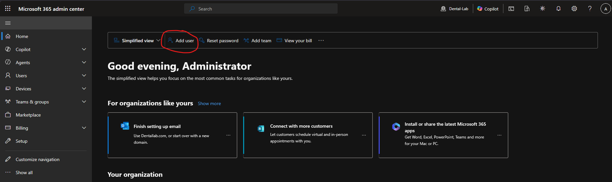
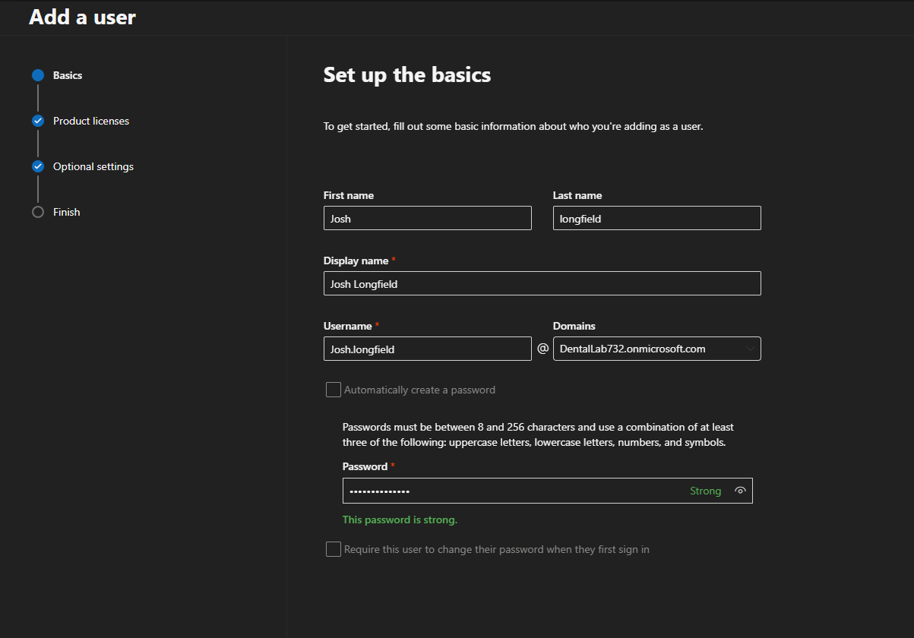
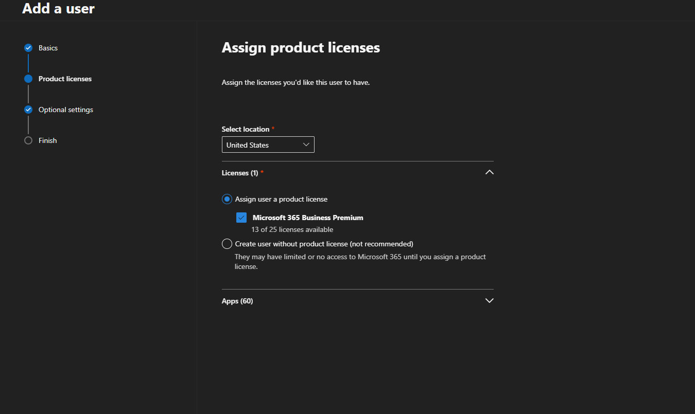
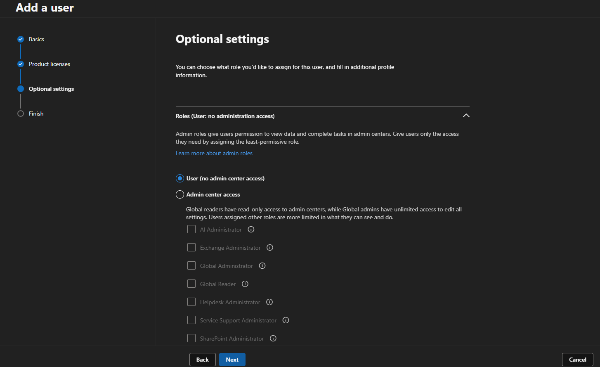

# User Onboarding

## Overview

This document explains the user onboarding process for the M365 Dental Lab. The goal is to simulate how a new employee would be created and prepared in a Microsoft 365 environment.

In a real MSP or IT support environment, onboarding usually includes creating the user account, assigning the correct license, adding the user to groups, setting up mailbox access, requiring MFA, and confirming that the user can access the tools needed for their role.

## Scenario

A new employee is joining the dental office as a Front Desk Specialist.

New user example:

| Field | Information |
|---|---|
| Name | Sarah Frontdesk |
| Job Title | Front Desk Specialist |
| Department | Front Office |
| License | Microsoft 365 Business Premium |
| Groups | Front Office, All Staff |
| Shared Mailbox Access | Front Desk Mailbox |
| MFA Required | Yes |

## Onboarding Tasks

The following steps were completed for the new user:

1. Created the user account in the Microsoft 365 Admin Center.
2. Assigned a Microsoft 365 Business Premium license.
3. Added job title and department information.
4. Added the user to the correct groups.
5. Granted access to the correct shared mailbox.
6. Required the user to set up MFA.
7. Verified the user appeared in the active users list.
8. Confirmed the user had the correct license and group membership.

## Step 1: Create the User

The user was created from the Microsoft 365 Admin Center.

Path used:

```text
Microsoft 365 Admin Center > Users > Active users > Add a user
```



## Step 2: fill out basic details

In this section, first and last name should be filled out. 

Display name should automatically fill out. 

In this case username should be a first and last name with a "." in the middle, additionally, we also only have 1 domain available. 

For new users, a standard password will be provided. It will be the first letter of your first and last names. Both of the first Letter of our company name followed with the start date of the new hire and two "!!" at the end. 

Ex: 

Name: John Moon = JM
company: Dental Lab = DL
date of hire: 06/28/2026

his standard password would be: JMDL06282026!!



## step 3: assign licenses

Next page would be where you would assign licenses. In this case we only have one, in general everyone should have the business premium licenses and more advanced employees can be upgraded upon manager's request. 




## step 4: optional settings

no optional settings should be allowed, unless the new hire is part of the admin department. 



## step 5: verify new user

Once everything has been completed. The new user will automatically appear under the "user section". 