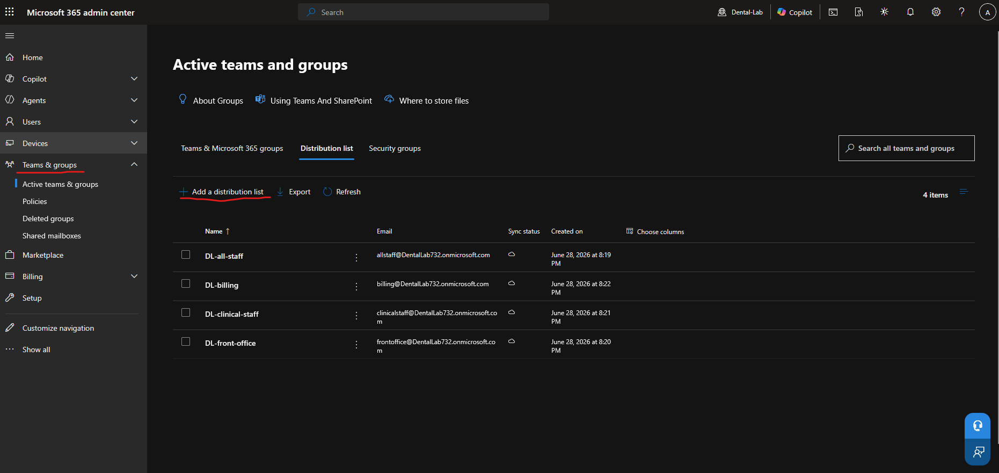

# distribution lists

## purpose

A distribution list is used to send an email to multiple users at the same time. Instead of sending emails individually, you can send an email to a specific mailbox that everyone who is a member receives. 

## Distribution Lists Created

* DL-all-staff = sends emails to everyone
* DL-front-office = sends emails to the front staff
* DL-clinical-staff = sends emails to dentists, hygienists, and assistants
* DL-billing = sends billing related emails

## this lab

for this lab, if someone sends an email to "frontoffice@dentallab732.onmicrosoft.com", the email goes to everyone in that distribution list. 

