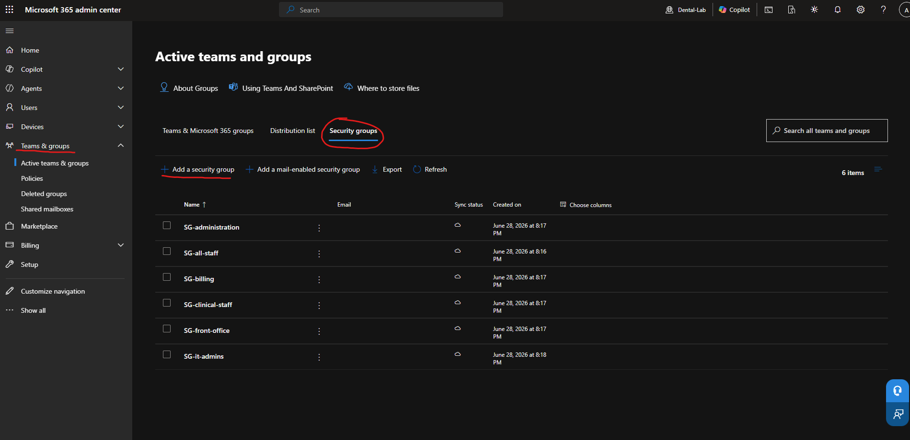

# Security Groups

Security groups are used to organize users and manage access to Microsoft 365 resources, policies, and permissions. In this lab, the groups are based on departments inside a simulated dental office.

The goal is to make user access easier to manage instead of assigning permissions to each user one by one.

## why are securirity groups used

They help with: 

* Organizing users by department
* Managing access to resources
* Applying security polices
* Applying intune policies
* Making onboarding earsier
* Making offboarding cleaner

For example, instead of assigning a policy to each front office employee individually, the policy can be assigned to the SG-Front-Office group.

## security groups created

* SG-all-staff = includes all employees in the office
* SG-front-office = includes front desk and scheduling users
* SG-clinical-staff = includes dentists, hygienists, and dental assistants
* SG-billing = includes billing and insurance users
* SG-administration = includes office managers and practice managers
* SG-it-admins = includes admin or IT support accounts

