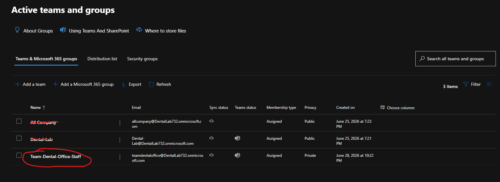

# Teams and Microsoft 365 Groups

## overview

This document covers the Microsoft Team and Microsoft 365 group created for the M365 Dental Lab.

Microsoft Teams and Microsoft 365 groups are used for collaboration. They give users a shared place to communicate, store files, and work together.

For this lab, I kept the Teams setup simple because the main focus of this project is Microsoft 365 administration, user management, Exchange, security groups, Conditional Access, and Intune.

## Purpose

The purpose of creating a Team is to simulate how a small dental office could use Microsoft Teams for internal communication and collaboration.

This Team can be used for:

* staff communication
* office updates/announcements
* shared files
* internal collabs

## teams I have created

so far, I've created one for all staff members. 

* Team-Dental-Office-Staff

I created this Team to give the fake dental office a central place for communication and file sharing.

In a real business environment, a team like this could be used by employees to discuss office updates, share documents, and communicate internally without relying only on email.

