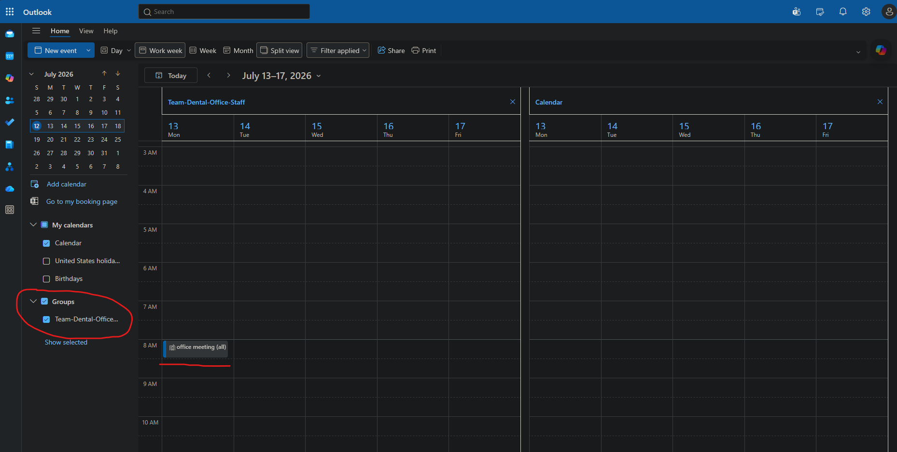

# Shared calendar among team members

## purpose

this document is to showcase how to create a shared calendar, add members to a shared mailbox, and the different settings that go along with it. 

## shared calendar

I decided to make an official dental lab calendar that can be used internally for users at the dental lab. 

Name: Dental Lab official calendar
Email: dentallabofficialcalendar@DentalLab732.onmicrosoft.com

The calendar can be used for: 

* staff meetings
* training
* vacation tracking

## setup steps

1. Open the Microsoft 365 Admin Center.
2. Go to Teams & groups.
3. Select Shared mailboxes.
4. Create a shared mailbox named Dental Lab Schedule.
5. Add the employees who need access.
6. Open Outlook and confirm the shared calendar appears.
7. Create a test calendar event.
8. Confirm another user can view and edit the event.

## settings

* Read and manage permissions: Lets the person open the shared mailbox, read and manage its emails, and view or edit its calendar. It does not allow sending emails from the shared address. (this settings is most likely what is needed for most cases)
* Send as permissions: Lets the person send an email that appears to come directly from the shared mailbox. Example:
From: dentallabofficialcalendar@DentalLab732.onmicrosoft.com
* Send on behalf of permissions: Lets the person send an email while showing both names. Example:
Anthony on behalf of Dental Lab Schedule
* adding from the members section is also ideal. Usually gives the user read and manage and send as permissions. 

## screenshot

I have added a screenshot inside outlook > calendar. Make sure to enable the group calendar on the left side. Anyone in the group can see this event. I have scheduled a fake meeting on monday - 8am for everyone. 