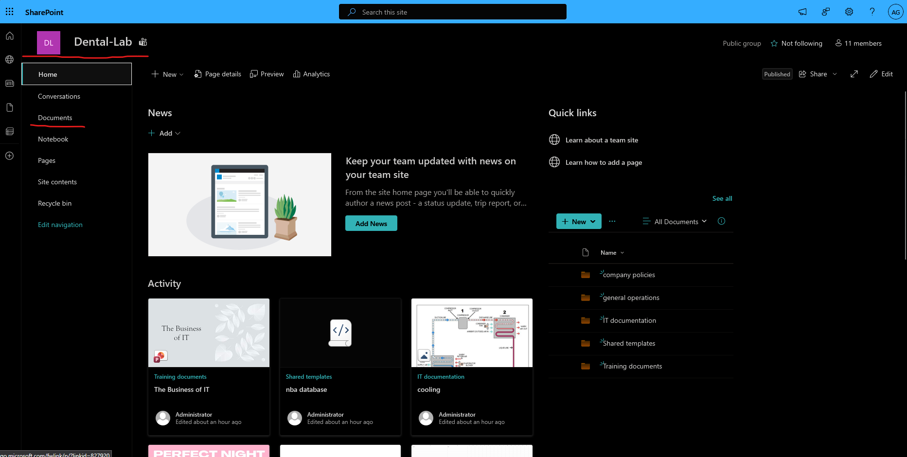
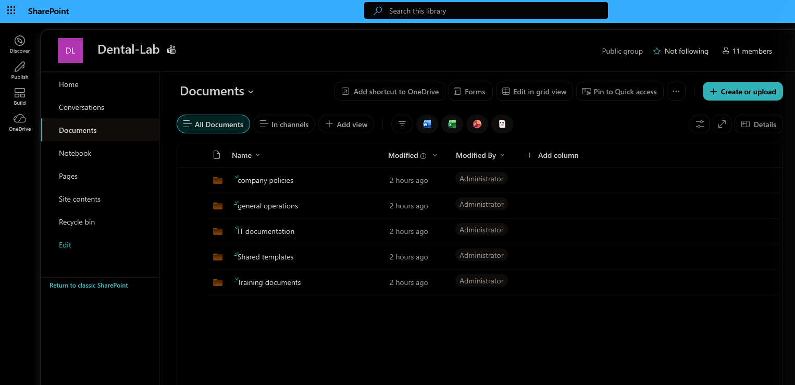

# SharePoint Setup

## Overview

SharePoint was configured for the Dental Lab Microsoft 365 environment.

The purpose of the SharePoint site is to **provide employees with a central location for shared documents, procedures, templates, and training files.**

## Site Used

The existing SharePoint site named:

```text
Dental-Lab
```




This was already from an existing m365 team. Essentially, anyone working at the detal lab was already a member. 

## documents and folders

Inside documents, I decided to create the following folders: 

* Company Policies
* General Operations
* IT Documentation
* Shared Templates
* Training Documents




I made a few fake files to simulate a true sharepoint folder. 
While everything was created with the admin account, I made sure to check 


## Planned Improvements

Future SharePoint tasks may include:

* Creating department-specific sites
* Testing file editing and sharing
* Adding restricted sites for HR or management
* Customizing the SharePoint homepage
* Adding company announcements and useful links