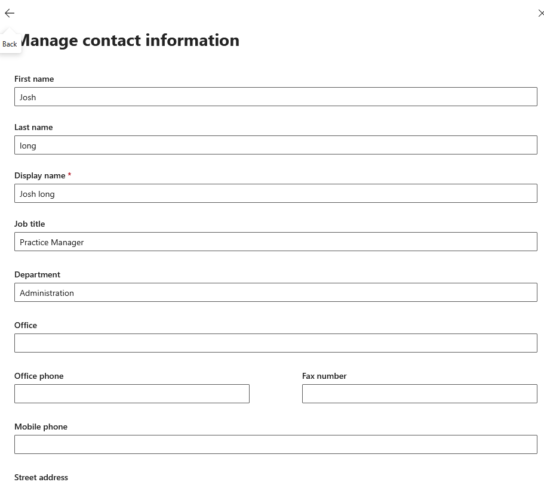
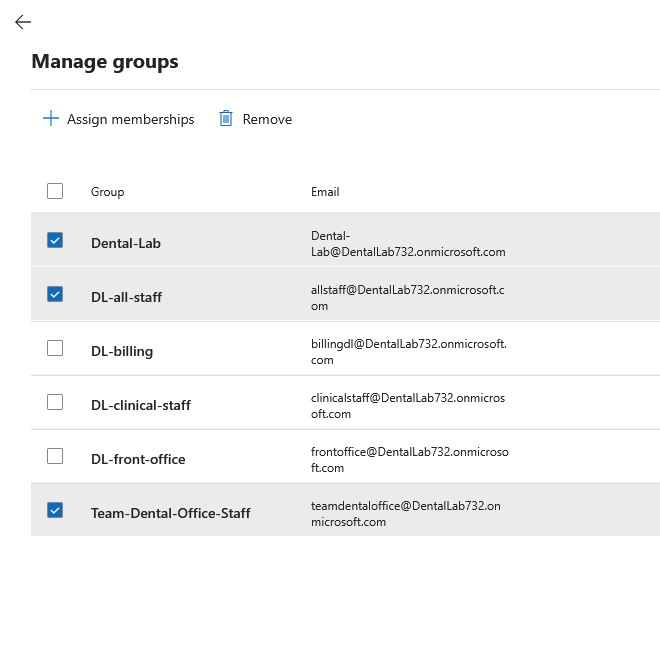
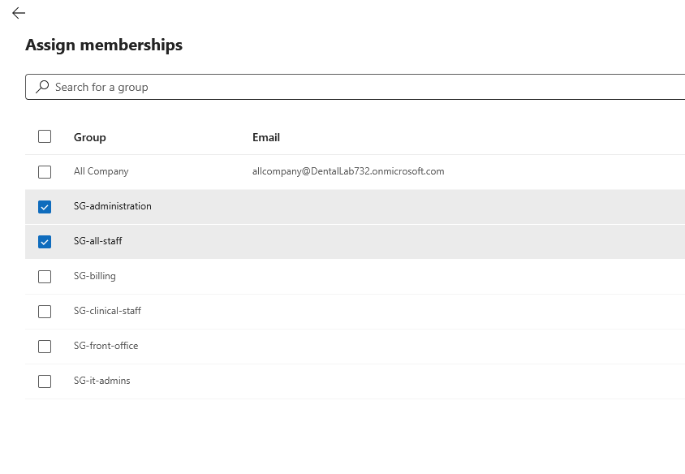
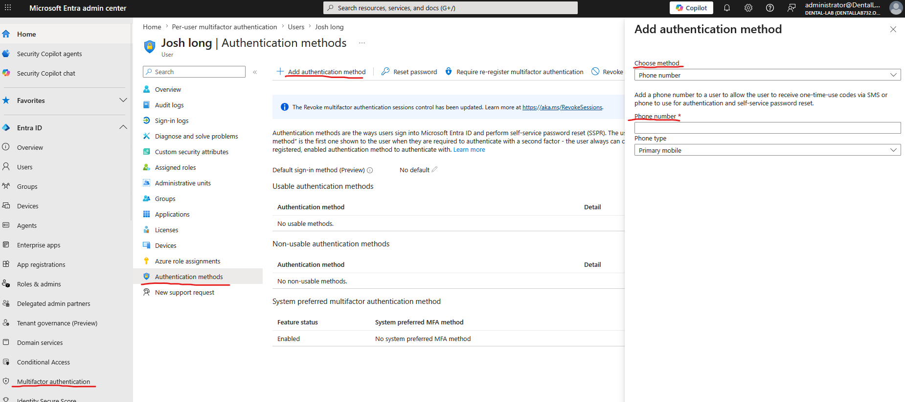

# overview

**Josh Longfield** is the new hire for the dental lab team. Below are the steps for Josh's account creation. 


## Step 1: Create the User

The user was created from the Microsoft 365 Admin Center.

Path used:

```text
Microsoft 365 Admin Center > Users > Active users > Add a user
```


## Step 2: fill out basic details

In this section, first and last name should be filled out. 

Display name should automatically fill out. 

In this case username should be a first and last name with a "." in the middle, additionally, we also only have 1 domain available. 

For new users, a standard password will be provided. It will be the first letter of your first and last names. Both of the first Letter of our company name followed with the start date of the new hire and two "!!" at the end. 

Ex: 

Name: John Moon = JM
company: Dental Lab = DL
date of hire: 06/28/2026

his standard password would be: JMDL06282026!!


## step 3: assign licenses

Next page would be where you would assign licenses. In this case we only have one, in general everyone should have the business premium licenses and more advanced employees can be upgraded upon manager's request. 


## step 4: optional settings

no optional settings should be allowed, unless the new hire is part of the admin department. 


## step 5: verify new user

Once everything has been completed. The new user will automatically appear under the "user section". 

## step 6: contact information

The user should now be active within the environment. We want to fill out some information that can help identify Josh. In this case, he is a **practice manager** in the **administration** department. 

* open up his account
* click on "manage contact information" under phone number.
* fill out the information available
  



## step 7: groups

In the real world, a list of groups would be provided to add the new user to. Since I am the admin, I can choose :smiley_face: 

I will add him to the following groups: 

* DL-all-staff - eveybody gets access
* Dental-Lab - sharepoint
* Team-Dental-Office-Staff - in case he needs access to office docs.



## step 8: memberships

I added him to these memberships for now: 

* SG-administration
* SG-All-users



## step 9: MFA

MFA must be enabled for all users. 

* start at Entra ID
* under "all users" find the specific user and open it up
* on the left hand side click on "authentication method"
* at the top click "add authentication method"
* a new panel show pop up on the right side, in here you would want to select the method. In this case, phone number. 
  * So from now on, everytime, Josh logs in, he will be prompted to type in MFA. 
  
  



**as the lab continues to progress, more details may be added**

