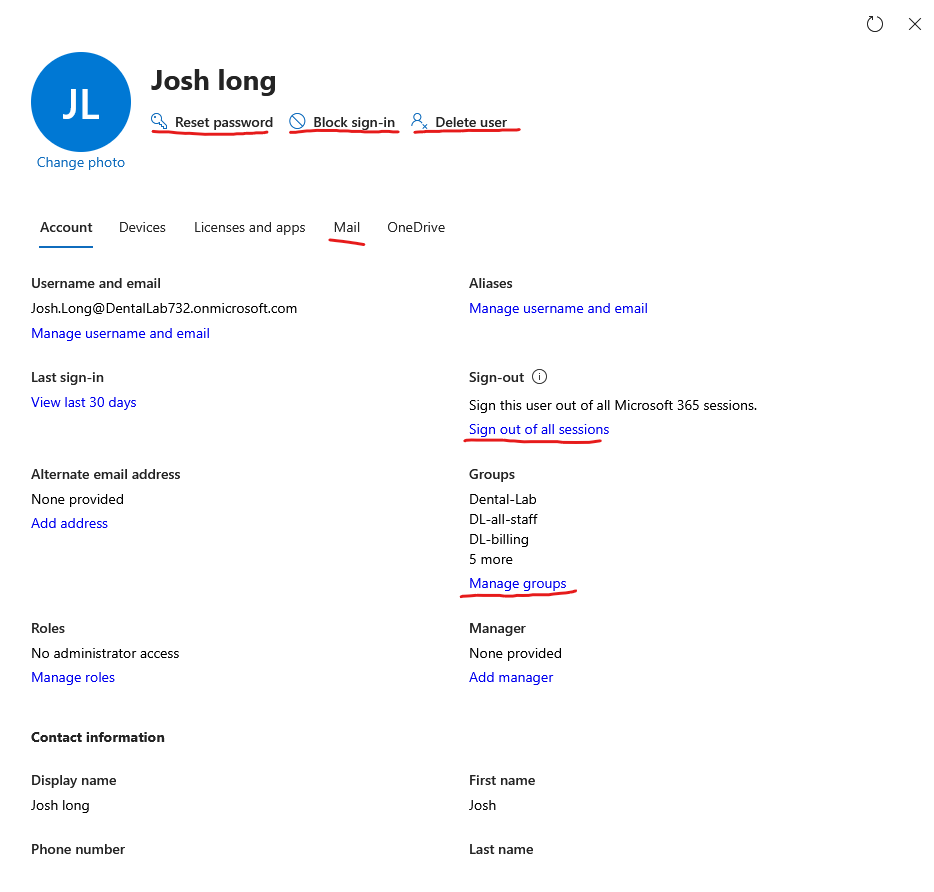

# User offboarding

## scenario

unfortunately, Josh is leaving the dental lab. His M365 access will therefore be removed.

## objective

1. block sign in
2. force sign out of all sections
3. reset password > create a new one
4. take off licenses
5. remove from groups
6. remove from security groups
7. convert mailbox to a shared mailbox
8. (move to delete user account)
   1. only move to deleted folder once the shared mailbox is no longer in use.

##  block sign in, force sign out, reset password, remove licenses, remove groups + security groups, delete user

Most of the objectives can be completed on the first page of the user environment.

I have highlighted everything in red that can be completed. 

**if the mail button is frozen, you may need to navigate to exchange and convert the mailbox from there**

Note: removing a license can be reused for a different user. Say a new emplpoyee comes in, you can assign the new user with the extra license.

A lot of the information is this repo under docs so not much detail will be needed. 

At last, deleting the user will give you 30 days to reverse the action or it's gone. 

