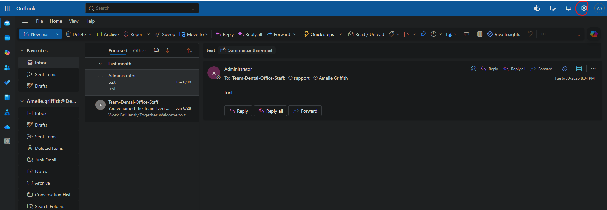
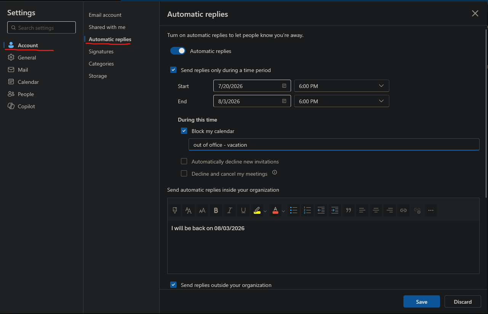
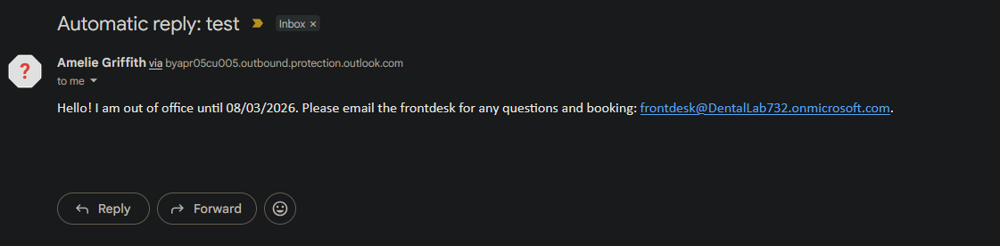
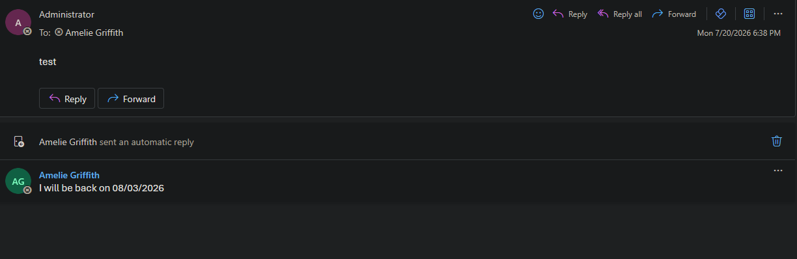

# scenario 

A user is leaving for vacation. He does not need his mailbox to be shared, however, he would like to have a message that automatically replies to senders for the time being. 

## steps

1. login to the user account (outlook web/outlook classic)
2. find the gear icon, on outlook web it's located in the top right corner.
3. click on account
4. automatic replies
5. Enable it at the top 
6. Automatic gives you a few options.
   1. You can send replies during a time period
   2. The first box is for sending replies to people in your organization
   3. Second box is for people outside of your organization.

## result

I emailed the user from my personal email and from a user inside the organization.

